<!-- SPDX-FileCopyrightText: Copyright (c) Pierre-Yves Lapersonne -->
<!-- SPDX-License-Identifier: MIT -->
<!-- ✿✿✿✿ ʕ •ᴥ•ʔ/ ︻デ═一 -->

<!-- Motto -->
<h1 align="center" style="font-weight: bold;">
✨ Contribute to open source out of passion for challenge, future and independence ✨
</h1>

<!-- Menu -->

  <a href="https://pylapersonne.info" title="My personal website">Website</a>
  ·
  <a href="https://pylapersonne.info/cv" title="My resume">CV</a>
  ·
  <a href="https://pylapersonne.info/donate" title="Support solutions">Support</a>

<!-- Profesional life -->
## 🍊 At Orange

**iOS software engineer at [Orange](https://orange.com) in France 🇫🇷.**

One of the core maintainers of [Orange Unified Design System](https://github.com/Orange-OpenSource/ouds-ios) iOS librairy.

  
List of current projects (5)

  
  - [a11y-guidelines](https://github.com/Orange-OpenSource/a11y-guidelines)
  - [accessibility-statement-lib-ios](https://github.com/Orange-OpenSource/accessibility-statement-lib-ios)
  - [floss-toolbox](https://github.com/Orange-OpenSource/floss-toolbox)
  - [OUDS iOS (Design System Toolbox app)](https://github.com/Orange-OpenSource/ouds-ios-design-system-toolbox)
  - [OUDS iOS (Swift Package)](https://github.com/Orange-OpenSource/ouds-ios)

  
List of former projects (7)

  
  - [BaahBox Android](https://github.com/Orange-OpenSource/BaahBox-Android)
  - [BaahBox iOS](https://github.com/Orange-OpenSource/BaahBox-iOS)
  - [copyright-checker](https://github.com/Orange-OpenSource/copyright-checker)
  - [gradle-properties-checker](https://github.com/Orange-OpenSource/gradle-properties-checker)
  - [ODS iOS](https://github.com/Orange-OpenSource/ods-ios)
  - [Swift-AssetsLegalMentionsChecker](https://github.com/Orange-OpenSource/Swift-AssetsLegalMentionsChecker)
  - [Swift-SourcesHeaderChecker](https://github.com/Orange-OpenSource/Swift-SourcesHeaderChecker)

<!-- Personal life -->
## 🧑‍💻 On my side

**I enjoy contributing to open source projects, overall if they are softwares I use in my personal life or professional activities.**

<!-- Current personal active projects -->

  
Current personal projects (1)

  
  - [Tips'n'tools](https://github.com/pylapp/Tips-tools)

<!-- Personal archived projects (alphabetical order) -->

  
Some archived projects of mine (2)

  
  - [tapsterbot](https://github.com/pylapp/tapsterbot)
  - [Smooth Clicker](https://github.com/pylapp/SmoothClicker)

<!-- Projects I contributed to (alphabetical order) -->

  
External projects I contributed to (16)

  - [2FAS iOS](https://github.com/twofas/2fas-ios)
  - [Cryptomator iOS](https://github.com/cryptomator/ios)
  - [developers conferences agenda](https://github.com/scraly/developers-conferences-agenda)
  - [Ice Cubes](https://github.com/Dimillian/IceCubesApp)
  - [Impressia](https://github.com/Impressia/Impressia)
  - [maigret](https://github.com/soxoj/maigret)
  - [mlem](https://github.com/mlemgroup/mlem)
  - [Monal](https://github.com/monal-im/Monal)
  - [Nearby Weather](https://github.com/erikmartens/nearbyweather-legacy)
  - [open source events](https://github.com/Everything-Open-Source/open-source-events)
  - [OsmAnd iOS](https://github.com/osmandapp/OsmAnd-iOS)
  - [sherlock](https://github.com/sherlock-project/sherlock)
  - [stats](https://github.com/exelban/stats)
  - [Strongbox](https://github.com/strongbox-password-safe/Strongbox)
  - [Tella iOS](https://github.com/Horizontal-org/Tella-iOS)
  - [Vite ma dose](https://github.com/CovidTrackerFr/vitemadose-ios)
  

<!-- Metrics, stats, figures -->
## 📈 Stats

 <!-- Updated thank to GitHub Action update-stats.yml workflow -->

<!-- Trophies -->
## 🏆 GitHub Trophies

 <!-- Updated thank to GitHub Action update-trophies.yml workflow -->

<!-- Holopins -->
## 🏅 Pins

<!-- Sponsors -->
## 🤩 Sponsors

<!-- From https://github.com/JamesIves/github-sponsors-readme-action -->
<!-- Note that for "private" sponsors the personal data like logins and avatars might be unavailable -->

<!-- real-sponsors -->&nbsp;&nbsp;<!-- real-sponsors -->

